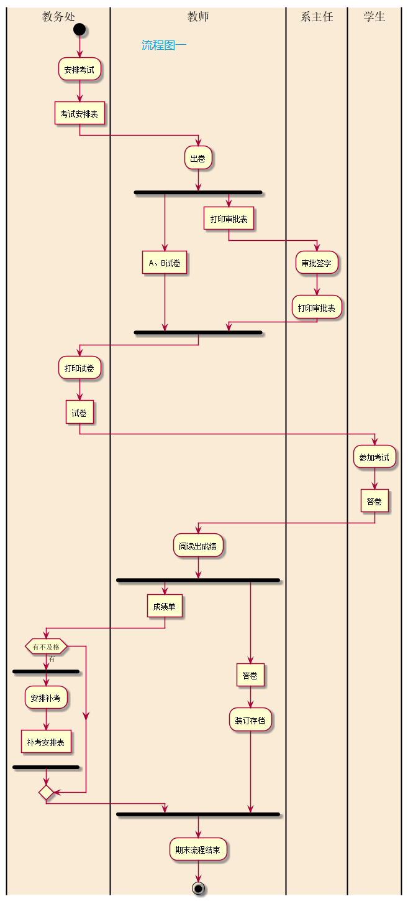
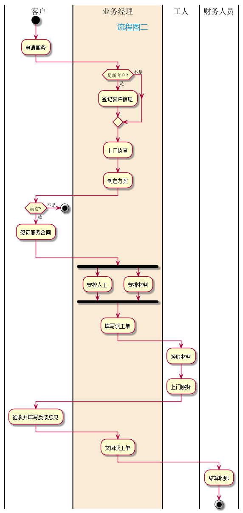

#实验一：业务流程建模
<table>
    <tr>
        <td>学号</td>
		<td>班级</td>
		<td>姓名</td>
    </tr>
	<tr>
        <td>201510414406</td>
		<td>2015-软件工程(4班)</td>
		<td>蒋春林</td>		
    </tr>
</table>
 

<h2>一.考试及成绩管理流程图</h2>
#1.1代码如下所示:
@startuml 
|教务处| 
start 
:安排考试; 
:考试安排表] 
|#AntiqueWhite|教师| 
:出卷; 
fork 
    :A、B试卷| 
fork again 
    :打印审批表] 
|#AntiqueWhite|系主任| 
    :审批签字; 
    :打印审批表; 
end fork 
|#AntiqueWhite|教务处| 
:打印试卷; 
:试卷] 
|#AntiqueWhite|学生| 
:参加考试; 
:答卷] 
|#AntiqueWhite|教师| 
:阅读出成绩; 
fork 
    :成绩单] 
|#AntiqueWhite|教务处| 
if (有不及格) then (有) 
    fork 
    :安排补考; 
    :补考安排表] 
    detach 
    end fork 
endif 
|#AntiqueWhite|教师| 
fork again 
    :答卷] 
    :装订存档; 
end fork 
:期末流程结束; 
stop 
@enduml 

###图一：
 

<h2>二.客户维修服务流程</h2>
#2.1代码如下所示:
@startuml 
|客户| 
start 
:申请服务; 
|#AntiqueWhite|业务经理| 
if (是新客户?) then (是) 
:登记客户信息; 
else (不是) 
endif 
:上门侦查; 
:制定方案; 
|客户| 
if (满意?) then (不是) 
stop 
else (是) 
:签订服务合同; 
endif 
|业务经理| 
fork 
:安排人工; 
fork again 
:安排材料; 
endfork 
:填写派工单; 
|工人| 
:领取材料; 
:上门服务; 
|客户| 
:验收并填写反馈意见; 
|业务经理| 
:交回派工单; 
|财务人员| 
:结算收账; 
stop 
@enduml 

###图二：
 
