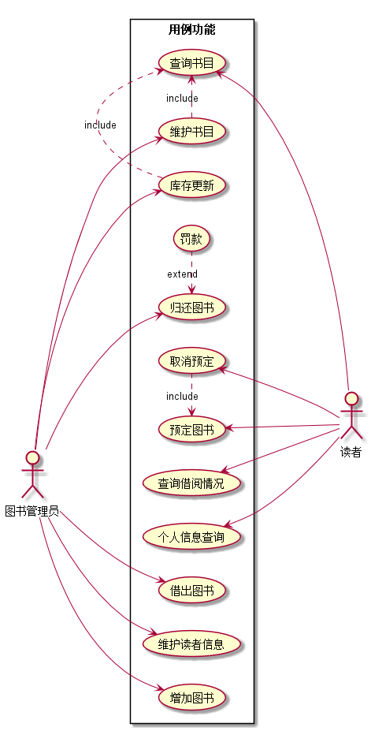
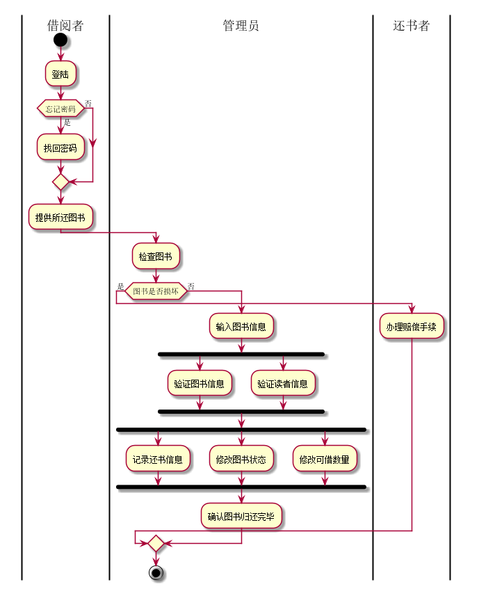

图书管理系统的用例关系图
----
<h3>1.1用例图的源码如下:</h3>
@startuml 
left to right direction 
skinparam packageStyle rectangle 
:图书管理员: as Admin 
:读者: as User 

rectangle 用例功能 { 

(取消预定)<--- User  
(查询借阅情况)  <--- User  
(预定图书) <--- User 
(查询书目) <--- User 
(个人信息查询)<--User 

Admin --> (维护书目) 
Admin --> (借出图书) 
Admin --> (归还图书) 
Admin --> (维护读者信息) 
Admin --> (库存更新) 
Admin --> (增加图书) 

(维护书目)  .> (查询书目) : include 
(库存更新)  .> (查询书目) : include 
(归还图书).>(罚款) : extend 
(预定图书).>(取消预定) : extend 

} 
@enduml 
<h3>1.2用例图如下:</h3>
</img>
<h1>2.参与者说明:</h1>
---
<h3>2.1图书管理员</h3>

主要职责是:维护书目、增加图书、维护读者信息、借出图书、归还图书、库存更新

<h3>2.2读者</h3>

主要职责是:个人信息查询、查询书目、查询借阅情况、预定图书、取消预定

<h1>3.用例规约表:</h1>
---
<h3>3.1 "个人信息查询"用例</h3>
3.1.1. "个人信息查询"用例规约
<table>
	<tr>
		<td>用例名称:</td>
		<td>个人信息查询</td>
	</tr>
	<tr>
		<td>参与者:</td>
		<td>读者</td>
	</tr>
	<tr>
		<td>前置条件:</td>
		<td>成功登陆该系统</td>
	</tr>
	<tr>
		<td>后置条件:</td>
		<td>显示出对应的读者个人信息</td>
	</tr>
	<tr>
		<td colspan="2">主流事件</td>
	</tr>
	<tr>
		<td>参与者动作</td>
		<td>系统行为</td>
	</tr>
	<tr>
		<td>1.读者点击个人信息按钮</td>
		<td>2.系统根据穿过来的读者编号查询数据库 
            3.显示读者对应的各项信息
        </td>
	</tr>
	<tr>
		<td colspan="2">备选事件流</td>
	</tr>
	<tr>
		<td colspan="2">1a.查询数据库异常 
&nbsp; &nbsp;&nbsp;-提示信息显示错误
		</td>
	</tr>
	<tr>
		<td colspan="2">业务规则</td>
	</tr>
	<tr>
		<td colspan="2">1.</td>
	</tr>
</table>
3.1.2. 个人信息查询用例流程图源码:   
@startuml   
|教务处|   
start  
@startuml  
start  
:点击个人信息按钮;  
:显示对应的个人信息;  
stop  
@enduml  
stop  
@enduml  
3.1.3. 个人信息查询用例流程图:  
</img>
-----------------
<h3>3.2 "查询书目"用例</h3>
3.2.1. "查询书目"用例规约
<table>
	<tr>
		<td>用例名称:</td>
		<td>查询书目</td>
	</tr>
	<tr>
		<td>参与者:</td>
		<td>读者</td>
	</tr>
	<tr>
		<td>前置条件:</td>
		<td>成功登陆该系统</td>
	</tr>
	<tr>
		<td>后置条件:</td>
		<td>显示出对应查询的书目信息</td>
	</tr>
	<tr>
		<td colspan="2">主流事件</td>
	</tr>
	<tr>
		<td>参与者动作</td>
		<td>系统行为</td>
	</tr>
	<tr>
		<td>
		1.读者在搜索框输入想要查询书目信息的图书名字或者图书编号  
		2.点击查询书目的按钮
</td>
		<td>2.系统根据穿过来的图书编号或者图书的名字去查询数据库 
            3.显示读者对应的书目的各项信息
        </td>
	</tr>
	<tr>
		<td colspan="2">备选事件流</td>
	</tr>
	<tr>
		<td colspan="2">1a.查询数据库异常 
&nbsp; &nbsp;&nbsp;-提示信息显示错误     
						2a.输入的图书编号有误 
&nbsp;&nbsp;&nbsp;-提示图书编号错误 
                        3a.图书名字匹配错误 
&nbsp;&nbsp;&nbsp;-提示书名输入错误，请重新输入
		</td>
	</tr>
	<tr>
		<td colspan="2">业务规则</td>
	</tr>
	<tr>
		<td colspan="2">1.</td>
	</tr>
</table>
3.2.2. 查询书目用例流程图源码:  
3.2.3. 查询书目用例流程图  

------------------------------

<h3>3.3 "查询借阅情况"用例</h3>
3.3.1.  "查询借阅情况"用例规约 
<table>
	<tr>
		<td>用例名称:</td>
		<td>查询借阅情况</td>
	</tr>
	<tr>
		<td>参与者:</td>
		<td>读者</td>
	</tr>
	<tr>
		<td>前置条件:</td>
		<td>成功登陆该系统，点击查询借阅情况链接</td>
	</tr>
	<tr>
		<td>后置条件:</td>
		<td>显示出对应的读者的借阅情况的信息</td>
	</tr>
	<tr>
		<td colspan="2">主流事件</td>
	</tr>
	<tr>
		<td>参与者动作</td>
		<td>系统行为</td>
	</tr>
	<tr>
		<td>
		1.读者成功登陆该系统后在页面里点击借阅情况查询链接
		
</td>
		<td>2.系统根据穿过来的读者的编号值去查询数据库 
            3.显示读者对应的借阅图书的详细信息
        </td>
	</tr>
	<tr>
		<td colspan="2">备选事件流</td>
	</tr>
	<tr>
		<td colspan="2">1a.查询读者借阅信息时数据库异常 
&nbsp; &nbsp;&nbsp;-提示信息显示错误  
		</td>
	</tr>
	<tr>
		<td colspan="2">业务规则</td>
	</tr>
	<tr>
		<td colspan="2">1.</td>
	</tr>
</table> 
3.3.2.  "查询借阅情况"用例流程图源码:    
3.3.3.  "查询借阅情况"用例流程图
   
--------------------------
<h3>3.4 "预定图书"用例</h3>
3.4.1. "预定图书"用例规约  
<table>
	<tr>
		<td>用例名称:</td>
		<td>预定图书</td>
	</tr>
	<tr>
		<td>参与者:</td>
		<td>读者</td>
	</tr>
	<tr>
		<td>前置条件:</td>
		<td>1. 成功登陆该系统 
			2. 预定的图书存在 
			3. 该读者拥有该图书的预定权限 
			4. 该读者还有可以预定图书的次数        
</td>
	</tr>
	<tr>
		<td>后置条件:</td>
		<td>1. 点击预定图书后，显示预定图书成功 
			2. 为读者绑定一条相应的预定图书的信息 
			3. 该图书的预定数加一 
			4. 预定的规定时间快结束时，提醒读者前来取书       
</td>
	</tr>
	<tr>
		<td colspan="2">主流事件</td>
	</tr>
	<tr>
		<td>参与者动作</td>
		<td>系统行为</td>
	</tr>
	<tr>
		<td>
		1.读者在搜索框输入想要预定书目信息的图书名字或者图书编号  
		  
		2.点击预定书目的按钮
</td>
		<td>3.系统根据穿过来的图书编号或者图书的名字以及读者的编号在数据库中新增一条数据用来保存该预定信息和读者之间的联系  
            4.显示读者对应的书目的各项信息
        </td>
	</tr>
	<tr>
		<td colspan="2">备选事件流</td>
	</tr>
	<tr>
		<td colspan="2">1a.无此书的预约权限 
&nbsp; &nbsp;&nbsp;-提示预定图书失败     
						2a.输入的图书编号有误 
&nbsp;&nbsp;&nbsp;-提示图书编号错误，请重新输入 
                        3a.图书名字匹配错误 
&nbsp;&nbsp;&nbsp;-提示书名输入错误，请重新输入 
4a.无剩余的预约次数 
&nbsp; &nbsp;&nbsp;-提示预定图书失败  
		</td>
	</tr>
	<tr>
		<td colspan="2">业务规则</td>
	</tr>
	<tr>
		<td colspan="2">1.</td>
	</tr>
</table>
3.4.2. "预定图书"用例流程图源码:    
3.4.3. "预定图书"用例流程图 

------------------

<h3>3.5 "取消预定"用例</h3>
3.5.1. "取消预定"用例规约  
<table>
	<tr>
		<td>用例名称:</td>
		<td>取消预定</td>
	</tr>
	<tr>
		<td>参与者:</td>
		<td>读者</td>
	</tr>
	<tr>
		<td>前置条件:</td>
		<td>1. 成功登陆该系统 
			2. 存在预定图书的信息        
</td>
	</tr>
	<tr>
		<td>后置条件:</td>
		<td>1. 点击取消预定图书后，显示取消预定成功 
			2. 删除之前生成的图书预定信息 
			3. 该图书的预定数减一      
</td>
	</tr>
	<tr>
		<td colspan="2">主流事件</td>
	</tr>
	<tr>
		<td>参与者动作</td>
		<td>系统行为</td>
	</tr>
	<tr>
		<td>
		1.读者登录该系统    
        2.进入个人中心的预定书目中去
		  
		2.点击取消预定书目的按钮
</td>
		<td>3.系统根据穿过来的图书编号或者图书的名字以及读者的编号在数据库中删除用来保存该预定信息和读者之间的联系  
            4.显示读者取消预定图书成功
        </td>
	</tr>
	<tr>
		<td colspan="2">备选事件流</td>
	</tr>
	<tr>
		<td colspan="2">1a.更新数据库异常 
&nbsp; &nbsp;&nbsp;-提示取消预定失败     
						2a.输入的图书编号有误 
&nbsp;&nbsp;&nbsp;-提示图书编号错误，取消失败，请重新输入 
                        3a.图书名字匹配错误 
&nbsp;&nbsp;&nbsp;-提示书名输入错误，取消失败，请重新输入
		</td>
	</tr>
	<tr>
		<td colspan="2">业务规则</td>
	</tr>
	<tr>
		<td colspan="2">1.</td>
	</tr>
</table>
3.5.2. "取消预定"用例流程图源码:    
3.5.3. "取消预定"用例流程图 

------------------------
<h3>3.6 "维护书目"用例</h3>
3.6.1. "维护书目"用例规约 
<table>
	<tr>
		<td>用例名称:</td>
		<td>维护书目</td>
	</tr>
	<tr>
		<td>参与者:</td>
		<td>管理员</td>
	</tr>
	<tr>
		<td>前置条件:</td>
		<td>1. 成功登陆该系统 
			2. 查询图书书目 
			3. 选则维护的图书种类 
			4. 操作具体的维护信息的表单或者相应的操作        
</td>
	</tr>
	<tr>
		<td>后置条件:</td>
		<td>1. 提交维护信息的表单后根据维护的种类在数据库中进行相应的数据表的更新操作 
			2. 提示维护书目是否成功 
			3. 显示维护书目的具体信息       
</td>
	</tr>
	<tr>
		<td colspan="2">主流事件</td>
	</tr>
	<tr>
		<td>参与者动作</td>
		<td>系统行为</td>
	</tr>
	<tr>
		<td>
		1.管理员做出具体的与之对应的维护书目的操作来维护书目
          
		  
		3.点击维护表单的提交按钮
</td>
		<td>2.系统根据表单传过来的维护信息更新相应的数据库中的表的信息  
            4.返回给管理员对应的提示信息
        </td>
	</tr>
	<tr>
		<td colspan="2">备选事件流</td>
	</tr>
	<tr>
		<td colspan="2">1a.无维护图书的权限 
&nbsp; &nbsp;&nbsp;-提示权限不足，不能维护图书信息     
						2a.输入有误的维护信息 
&nbsp;&nbsp;&nbsp;-提示维护信息有误，请核对正确后再提交维护信息，请重新输入 
                        3a.次图书暂时被锁定不能被维护 
&nbsp;&nbsp;&nbsp;-提示暂时禁止维护该图书信息，请稍后重试 
		</td>
	</tr>
	<tr>
		<td colspan="2">业务规则</td>
	</tr>
	<tr>
		<td colspan="2">1.</td>
	</tr>
</table> 
3.6.2. "维护书目"用例流程图源码:    
3.6.3. "维护书目"用例流程图

-------
<h3>3.7 "增加图书"用例</h3>
3.7.1. "增加图书"用例规约  
<table>
	<tr>
		<td>用例名称:</td>
		<td>增加图书</td>
	</tr>
	<tr>
		<td>参与者:</td>
		<td>图书管理员</td>
	</tr>
	<tr>
		<td>假设:</td>
		<td>管理员具备增加图书信息的权限</td>
	</tr>
	<tr>
		<td>前置条件:</td>
		<td>1. 图书管理员已被识别和授权 
			2. 填写新增图书的信息，然后提交表单 
</td>
	</tr>
	<tr>
		<td>后置条件:</td>
		<td> 在数据库的图书表中插入一条新的图书信息，显示可借的图书书目增加 
</td>
	</tr>
	<tr>
		<td colspan="2">主流事件</td>
	</tr>
	<tr>
		<td>参与者动作</td>
		<td>系统行为</td>
	</tr>
	<tr>
		<td>
		1.图书管理员登录此系统; 
		2.图书管理员将填写好的新的图书信息提交给系统;
          
		  
		5.图书管理员重复步骤2，直到退出
</td>
		<td>2.系统根据传入的新的图书信息更新图书表的数据; 
			3. 系统显示最新的所有的图书信息; 
            4.系统提示图书管理员增加图书成功;
        </td>
	</tr>
	<tr>
		<td colspan="2">备选事件流</td>
	</tr>
	<tr>
		<td colspan="2">1a.新增的图书信息重复 
&nbsp; &nbsp;&nbsp;-提示图书管理员已经存在对应的图书信息，不可重复添加     
						2a.插入数据库的表时出现异常 
&nbsp;&nbsp;&nbsp;-增加图书出现未知的异常，请重试 
                        3a.图书管理员没有权限 
&nbsp;&nbsp;&nbsp;-提示权限不足，不能维护增加信息 
		</td>
	</tr>
	<tr>
		<td colspan="2">业务规则</td>
	</tr>
	<tr>
		<td colspan="2">1.</td>
	</tr>
</table> 
3.7.2. "增加图书"用例流程图源码:    
3.7.3. "增加图书"用例流程图

--------
<h3>3.8 "维护读者信息"用例</h3>
3.8.1. "维护读者信息"用例规约  
<table>
	<tr>
		<td>用例名称:</td>
		<td>维护读者信息</td>
	</tr>
	<tr>
		<td>参与者:</td>
		<td>图书管理员</td>
	</tr>
	<tr>
		<td>假设:</td>
		<td>被维护的读者信息存在，并且管理员具备维护读者信息的权限</td>
	</tr>
	<tr>
		<td>前置条件:</td>
		<td>1. 图书管理员已被识别和授权 
			2. 查询出需要维护读者的信息 
			3. 填写修改读者信息的表单并提交 
</td>
	</tr>
	<tr>
		<td>后置条件:</td>
		<td> 修改对应读者的信息，提示管理员维护读者信息成功 
</td>
	</tr>
	<tr>
		<td colspan="2">主流事件</td>
	</tr>
	<tr>
		<td>参与者动作</td>
		<td>系统行为</td>
	</tr>
	<tr>
		<td>
		1.图书管理员查询出对应的读者信息; 
		2.图书管理员将更新后的读者信息提交给系统;
          
		  
		5.图书管理员重复步骤1，2，直到退出
</td>
		<td>2.系统根据传入的新的读者信息更新读者表的数据; 
			3. 系统显示最新的读者信息; 
            4.系统提示图书管理员读者信息维护成功;
        </td>
	</tr>
	<tr>
		<td colspan="2">备选事件流</td>
	</tr>
	<tr>
		<td colspan="2">1a.该读者用户被锁定 
&nbsp; &nbsp;&nbsp;-提示图书管理员，该用户信息被锁定不能被修改     
						2a.更新数据库的表时出现异常 
&nbsp;&nbsp;&nbsp;-更新异常，请重试 
                        3a.图书管理员没有权限 
&nbsp;&nbsp;&nbsp;-提示权限不足，不能维护读者信息 
		</td>
	</tr>
	<tr>
		<td colspan="2">业务规则</td>
	</tr>
	<tr>
		<td colspan="2">1.</td>
	</tr>
</table> 
3.8.2. "维护读者信息"用例流程图源码:    
3.8.3. "维护读者信息"用例流程图

-----------
<h3>3.9 "借出图书"用例</h3>
3.9.1. "借出图书"用例规约  
<table>
	<tr>
		<td>用例名称:</td>
		<td>借出图书</td>
	</tr>
	<tr>
		<td>参与者:</td>
		<td>图书管理员(主要参与员)、读者(次要参与者)</td>
	</tr>
	<tr>
		<td>前置条件:</td>
		<td>图书管理员已被识别和授权       
</td>
	</tr>
	<tr>
		<td>后置条件:</td>
		<td>存储借书记录，更新库存的数量，所借书状态为借出      
</td>
	</tr>
	<tr>
		<td colspan="1">主流事件</td>
		<td colspan="1">
		1. 图书管理员将读者借书卡提供给系统； 
		2. 系统验证读者的身份和借书的条件； 
		3. 图书管理员将读者所借图书输入系统; 
		4. 系统记录借书信息，并且修改图书的状态和次种书的可借数量; 
		5. 系统累加读者的借书量; 
		6. 重复3-5,直到图书管理员确认全部图书已经登记完毕; 
		7. 系统打印借书的清单，交易成功完成; 
</td>
	</tr>
	<tr>
		<td>备注</td>
		<td>图书馆开架借阅，读者找到书后办理借书的手续，因此借书不需要验证库存，而且每本书都是可以识别的。</td>
	</tr>
	<tr>
		<td>备选事件流</td>
		<td>
			2a. 非法读者 
&nbsp;&nbsp; 1.系统提示错误并拒绝接受输入 
            2b. 读者借书数已达到限额 
&nbsp;&nbsp; 1.系统提示错误并拒绝接受输入 
			5a. 读者借书数已达到限额 
&nbsp;&nbsp; 1.系统提示，并按要求输入 
&nbsp;&nbsp; 2.图书管理员确认借书完成 
			5b. 读者借书数已达到限额 
&nbsp;&nbsp; 1.删除该书的预定信息 
</td>
	</tr>
	
	
</table> 
3.9.2. "借出图书"用例流程图源码:    
3.9.3. "借出图书"用例流程图

----
<h3>3.10 "归还图书"用例</h3>
3.10.1. "归还图书"用例规约  
<table>
	<tr>
		<td>用例名称:</td>
		<td>归还图书</td>
	</tr>
	<tr>
		<td>参与者:</td>
		<td>图书管理员(主要参与员)、读者(次要参与者)</td>
	</tr>
	<tr>
		<td>假设:</td>
		<td>因为每本书都是可识别的，所以还书不需要验证读者</td>
	</tr>
	<tr>
		<td>前置条件:</td>
		<td>1. 图书管理员已被识别和授权 
</td>
	</tr>
	<tr>
		<td>后置条件:</td>
		<td>1. 修改借书记录，更新库存数量，修改图书的状态为可借 
</td>
	</tr>
	<tr>
		<td colspan="2">主流事件</td>
	</tr>
	<tr>
		<td>参与者动作</td>
		<td>系统行为</td>
	</tr>
	<tr>
		<td>
		1.图书管理员将图书提供给系统;
          
		  
		5.图书管理员重复步骤1，直到退出
</td>
		<td>2.系统根据借书记录验证图书信息; 
			3. 系统提供借阅该书的读者信息; 
            4.系统修改借书记录，更新该书的状态以及此书的可借数量;
        </td>
	</tr>
	<tr>
		<td colspan="2">备选事件流</td>
	</tr>
	<tr>
		<td colspan="2">1a.还书的读者信息不存在 
&nbsp; &nbsp;&nbsp;-提示不存在该读者的信息，请验证读者的合法性     
						2a.输入有误的图书信息 
&nbsp;&nbsp;&nbsp;-提示该图书信息有误，不是该图书馆里的图书信息 
                        3a.读者和借阅此图书信息不匹配 
&nbsp;&nbsp;&nbsp;-提示该读者并未借阅该图书，此图书的借阅者为另一读者 
		</td>
	</tr>
	<tr>
		<td colspan="2">业务规则</td>
	</tr>
	<tr>
		<td colspan="2">1.</td>
	</tr>
</table> 
3.10.2. "归还图书"用例流程图源码:    
@startuml  
|借阅者|  
start  
:登陆;  
if(忘记密码) then (是)  
:找回密码;  
else(否)  
endif  
:提供所还图书;  
|管理员|  
:检查图书;  
if (图书是否损坏) then (是)  
|还书者|  
:办理赔偿手续;  
|管理员|  
else(否)  
:输入图书信息;  
fork  
:验证图书信息;  
fork again  
:验证读者信息;  
end fork  
fork  
:记录还书信息;  
fork again  
:修改图书状态;  
fork again  
:修改可借数量;  
end fork  
|管理员|  
:确认图书归还完毕;  
endif  
stop  
@enduml  

3.10.3. "归还图书"用例流程图   
</img>

-----------
<h3>3.11 "库存更新"用例</h3>
3.11.1. "库存更新"用例规约  
<table>
	<tr>
		<td>用例名称:</td>
		<td>库存更新</td>
	</tr>
	<tr>
		<td>参与者:</td>
		<td>图书管理员</td>
	</tr>
	<tr>
		<td>假设:</td>
		<td>被更新库存的图书信息存在</td>
	</tr>
	<tr>
		<td>前置条件:</td>
		<td>1. 图书管理员已被识别和授权 
			2. 查询出需要更新库存的图书信息 
			3. 输入更新后的库存量，点击更新按钮，提交更新的数据信息 
</td>
	</tr>
	<tr>
		<td>后置条件:</td>
		<td> 修改对应图书的库存量，显示该图书的余量为更新后相对应的图书库存的余量 
</td>
	</tr>
	<tr>
		<td colspan="2">主流事件</td>
	</tr>
	<tr>
		<td>参与者动作</td>
		<td>系统行为</td>
	</tr>
	<tr>
		<td>
		1.图书管理员查询出对应的图书信息; 
		2.图书管理员将图书的库存量提供给系统;
          
		  
		5.图书管理员重复步骤1，2，直到退出
</td>
		<td>2.系统根据新的库存量和图书信息来更新图书信息; 
			3. 系统显示最新的图书库存量; 
            4.系统修改借书状态，更新该书的状态以及此书的可借数量;
        </td>
	</tr>
	<tr>
		<td colspan="2">备选事件流</td>
	</tr>
	<tr>
		<td colspan="2">1a.库存量的输入格式有误 
&nbsp; &nbsp;&nbsp;-提示库存数据输入有误，不能更新图书的库存     
						2a.更新数据库的表时出现异常 
&nbsp;&nbsp;&nbsp;-提示该图书库存更新异常，请重试 
                        3a.图书管理员没有权限来更新图书的库存 
&nbsp;&nbsp;&nbsp;-提示权限不足，不能更新图书的库存 
		</td>
	</tr>
	<tr>
		<td colspan="2">业务规则</td>
	</tr>
	<tr>
		<td colspan="2">1.</td>
	</tr>
</table> 
3.11.2. "库存更新"用例流程图源码:    
3.11.3. "库存更新"用例流程图

------------

