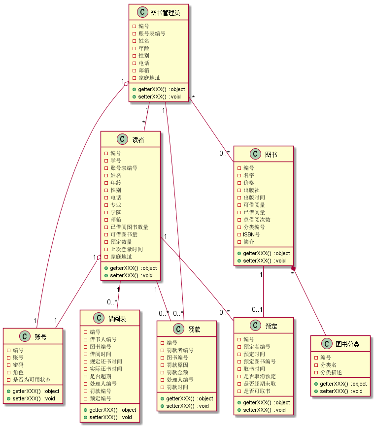
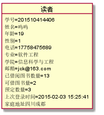
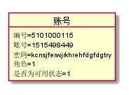
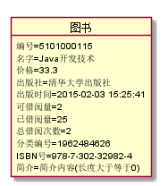
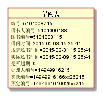
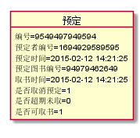
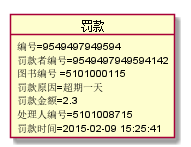

#  实验三:图书管理系统领域对象建模

------------

## 1.图书管理系统类图
### 1.1类图PlantUML源码如下所示:

@startuml  

class 图书管理员 {  
- 编号  
- 账号表编号 
- 姓名  
- 年龄  
- 性别 
- 电话 
- 邮箱 
- 家庭地址 
+  getterXXX()  :object 
+  setterXXX()  :void 
} 

class 读者 { 
- 编号 
-  学号 
- 账号表编号 
-  姓名 
-  年龄 
-  性别 
-  电话 
-  专业 
-  学院 
-  邮箱 
-  已借阅图书数量 
-  可借图书量 
-  预定数量 
-  上次登录时间 
-  家庭地址 
+  getterXXX()  :object 
+  setterXXX()  :void 
} 
 
class 账号 { 
-  编号 
-  账号 
-  密码 
- 角色 
- 是否为可用状态 
+  getterXXX()  :object 
+  setterXXX()  :void 
} 
 
 
class 图书 { 
- 编号 
- 名字 
- 价格 
- 出版社 
- 出版时间 
- 可借阅量 
- 已借阅量 
- 总借阅次数 
- 分类编号 
- ISBN号 
- 简介 
+  getterXXX()  :object 
+  setterXXX()  :void 
} 
 
class 图书分类 { 
- 编号 
- 分类名 
- 分类描述 
+  getterXXX()  :object 
+  setterXXX()  :void 
} 
class 借阅表 { 
- 编号 
- 借书人编号 
- 图书编号 
- 借阅时间 
- 规定还书时间 
- 实际还书时间 
- 是否超期 
- 处理人编号 
- 罚款编号 
- 预定编号 
+  getterXXX()  :object 
+  setterXXX()  :void 
} 
 
class 罚款 { 
- 编号 
- 罚款者编号 
- 图书编号 
- 罚款原因 
- 罚款金额 
- 处理人编号 
- 罚款时间 
+  getterXXX()  :object 
+  setterXXX()  :void 
} 
 
class 预定  { 
- 编号 
- 预定者编号 
- 预定时间 
- 预定图书编号 
- 取书时间 
- 是否取消预定 
- 是否超期未取 
- 是否可取书 
+  getterXXX()  :object 
+  setterXXX()  :void 
} 
  

读者 "1" o-- "1"账号 
图书管理员 "1" o--"1"账号 

图书管理员 "1"-- "*"读者 

图书 " * " *-- "1" 图书分类 
读者 "1"--"0.. * "借阅表 
读者 "1"-- "0.. * "预定 
读者 "1"-- "0.. * "罚款 
图书管理员 " * "-- "0.. * "图书 
图书管理员 "1"--"0..* "罚款 
图书 "1"--"0..1"预定 
  

@enduml 

### 1.2类图如下:
</img>
 

###  1.3类图说明:

#### 数据类对象设计的简单说明:

&nbsp;&nbsp;&nbsp;&nbsp;&nbsp;&nbsp;<strong> 因为现在的大多数程序在设计数据类型或者数据库的表格时，不在设计数据库表的时候添加对应的数据库表或者类之间的主外键的约束，而是通过编写代码来维护对应的主外键约束条件，每一张表对应相应的类，因此每个类在保存到数据库中的时候，需要为每个实例提供一个对应的主键值，该主键值只是用来标识这一行元素，除此再无其他的含义.</strong>

####  类图说明:
<strong>
1. 读者、图书管理员信息和他们的登录账号信息分为两个对象类，读者和图书管理员中保存了账号中的编号字段。以便后续需要增加对应的功能时方便增加属性字段，易于扩展。    
2. 图书管理员可以对图书信息和图书的种类进行一定的CRUD操作   
3. 读者中保存了已借阅图书量和可借图书量，以便读者在下次借书的时候判断是否该读者还可以再借图书，若可借书量大于0则可借，等于0则不允许借阅图书。    
4. 图书中保存了可借阅数量，方便读者在查询该图书时候，知道是否该图书还有余量，若有则可借阅，反之，则需要等至余量大于0.总借阅次数用来方便查询图书的借阅排行情况，方便知道某本图书的欢迎程度，以便增加库存数量。    
5. 罚款中保存了读者的编号，处理人编号，罚款金额，原因，以便后续能够知道，何人因为何种原因在那个时间被罚款，罚款的金额多少，处理人是谁，     
6. 预定中保存了读者的编号，若是超期未取，以便对读者进行一定的"惩罚"措施。    
</strong>

# 2.图书管理系统的对象图

----------

###  2.1类"管理员"的对象图
#### 源码如下:
@startuml  
object 图书管理员 {  
编号=5101000100  
姓名=詹三  
年龄=34  
性别=0  
电话=15832412345  
邮箱=asdxzs@163.com  
家庭地址=四川成都  
}  

@enduml 

####  对象图如下:
</img>
 

###  2.2类"读者"的对象图
#### 源码如下:
@startuml  
object 读者 { 
学号=201510414406 
姓名=呜呜 
年龄=19 
性别=1 
电话=17758475689 
专业=软件工程 
学院=信息科学与工程 
邮箱=jck@163.com 
已借阅图书数量=13 
可借图书量=2 
预定数量=3 
上次登录时间=2015-02-03 15:25:41 
家庭地址四川成都 
} 

@enduml
####  对象图如下:
</img>
 

###  2.3类"账号"的对象图
#### 源码如下:
@startuml  
object 账号 {  
编号=5101000115 
账号=1515498449 
密码=kcnsjferwjrkhrehfdgfdgtry 
角色=1 
是否为可用状态=1 
}  

@enduml 

####  对象图如下:
</img>
 

###  2.4类"图书"的对象图
#### 源码如下:
@startuml   
object 图书 { 
编号=5101000115 
名字=Java开发技术 
价格=33.3 
出版社=清华大学出版社 
出版时间=2015-02-03 15:25:41 
可借阅量=2 
已借阅量=25 
总借阅次数=2 
分类编号=1962484626 
ISBN号=978-7-302-32982-4 
简介=简介内容 
} 
 
@enduml 

####  对象图如下:
</img>
 

###  2.5类"图书种类"的对象图
#### 源码如下:
@startuml   
object 图书分类 { 
编号=9549497949594 
分类名=计算机类 
分类描述=描述内容 
} 
 
@enduml 

####  对象图如下:
</img>
 

###  2.6类"借阅信息"的对象图
#### 源码如下:
@startuml   
object 借阅表 { 
编号=5101008715 
借书人编号=5101000188 
图书编号=5101000115 
借阅时间=2015-02-03 15:25:41 
规定还书时间=2015-02-31 15:25:41 
实际还书时间=2015-02-09 15:25:41 
是否超期=0 
处理人编号=14949916215 
罚款编号=14949916166xx26215 
预定编号=1494991616626xx215 
} 
 
@enduml 

####  对象图如下:
</img>
 

###  2.7类"预定信息"的对象图
#### 源码如下:
@startuml   
object 预定  { 
编号=9549497949594 
预定者编号=1694929589595 
预定时间=2015-02-12 14:21:25 
预定图书编号=94979462649 
取书时间=2015-02-12 14:21:25 
是否取消预定=1 
是否超期未取=0 
是否可取书=1 
}  

@enduml 

####  对象图如下:
</img>
 

###  2.8类"罚款信息"的对象图
#### 源码如下:
@startuml   
object 罚款 { 
编号=9549497949594 
罚款者编号=9549497949594142 
图书编号 =5101000115 
罚款原因=超期一天 
罚款金额=2.3 
处理人编号=5101008715 
罚款时间=2015-02-09 15:25:41 
} 
 
@enduml 

####  对象图如下:
</img>
 

