# 图书管理系统的顺序图

-----

## *一、读者的顺序图*

###  1、查询图书信息用例  

#### 1.1 查询图书信息用例PlantUML源码:    
@startuml 
actor 读者  

alt 读者登录验证 
读者->图书管理系统 
end 
读者 -> 图书列表:查看存在的图书的列表 
图书列表-->读者:以二维表的形式显示所有的图书列表信息 

图书列表 -> 图书:查看列表中的某本图书的具体信息 
图书-->读者:显示对应的图书的详细描述信息 
@enduml  

#### 1.2 查询图书信息用例顺序图
 
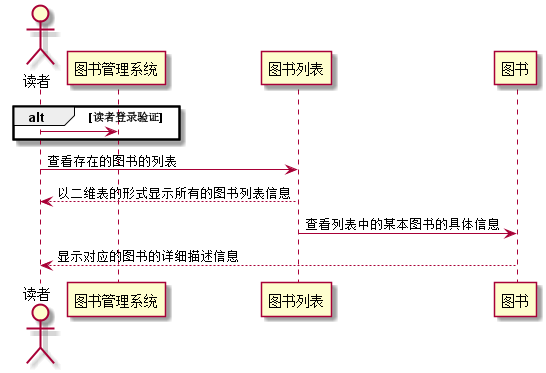</img>
#### 1.3 查询图书信息用例图说明

&nbsp;&nbsp;&nbsp;&nbsp;
读者登录系统后，可以查询图书馆中存在的所有图书的图书信息，读者可以在显示的图书列表中，点击具体查看的某本图书的信息。

------

###  2、个人信息查询用例
#### 2.1 个人信息查询用例PlantUML源码:
@startuml 
actor 读者 
 
alt 读者登录验证 
读者->图书管理系统 
end 
读者 -> 个人信息:查看自己的个人信息 
个人信息-->读者:返回详细的个人信息 
@enduml 

#### 2.2 个人信息查询用例顺序图

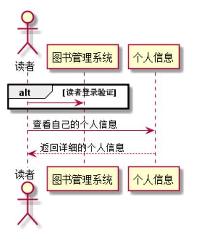

#### 2.3 个人信息查询用例图说明

&nbsp;&nbsp;&nbsp;&nbsp;
  用户登录图书管理系统后，可以查看自己的个人基本信息，如姓名、年龄、性别、注册时间等等的一些基本信息

---------

###  3、查询借阅情况用例
#### 3.1 查询借阅情况用例PlantUML源码:
@startuml 
actor 读者 
 
alt 读者登录验证 
读者->图书管理系统 
end 
读者 -> 借阅信息:查看自己的图书借阅情况信息 
借阅信息-->读者:返回个人的借阅信息 
@enduml  

#### 3.2 查询借阅情况用例顺序图
 
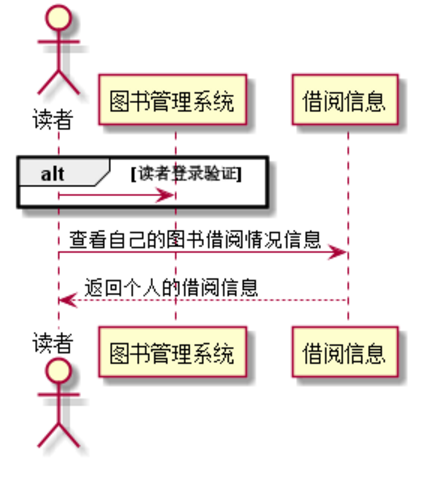
#### 3.3 查询借阅情况用例图说明

&nbsp;&nbsp;&nbsp;&nbsp;
	读者登录系统后，可查询自己总的可借书的数量，已借阅的图书数量，以及剩余可借书的数量。以便自己在借阅图书方便知道自己是否还能够借阅图书

---------

###  4、预定图书用例
#### 4.1 预定图书用例PlantUML源码:
@startuml 
actor 读者 
 
alt 读者登录验证 
读者->图书管理系统 
end 
 
alt 存在可预定的图书 
读者 -> 图书:查询可预定图书信息 
图书-->预定信息:生成一条预定图书的信息 
 
预定信息->读者:显示预定图书的具体信息 
else 不存在可预定图书信息  
读者 -> 图书:查询可预定图书信息 
图书管理系统-->读者:预定失败 
 
end 
@enduml 

#### 4.2 预定图书用例顺序图
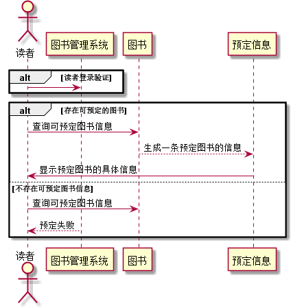

#### 4.3 预定图书用例图说明

&nbsp;&nbsp;&nbsp;&nbsp;
	读者在借阅图书时，图书管理系统，根据读者的账号来查询读者的借阅信息，以便判断是否还有可借书的数量，若是还有剩余借书量，则允许借阅图书，反之则不能借阅图书，提示归还图书后方可借阅图书。

-----

###  5、取消预定用例
#### 5.1 取消预定用例PlantUML源码:
@startuml 
actor 读者 
 
alt 读者登录验证 
读者->图书管理系统 
end 
 
alt 存在预定的图书信息 
读者 -> 预定信息:查询个人的预定图书信息 
读者->预定信息:取消某条预定信息 
 
预定信息->预定信息:修改预定信息 
 
预定信息-->读者:返回修改后的预定信息 
else 不存在预定图书信息 
图书管理系统-->读者:无可取消的预定 
end 
@enduml 

#### 5.2 取消预定用例顺序图
 
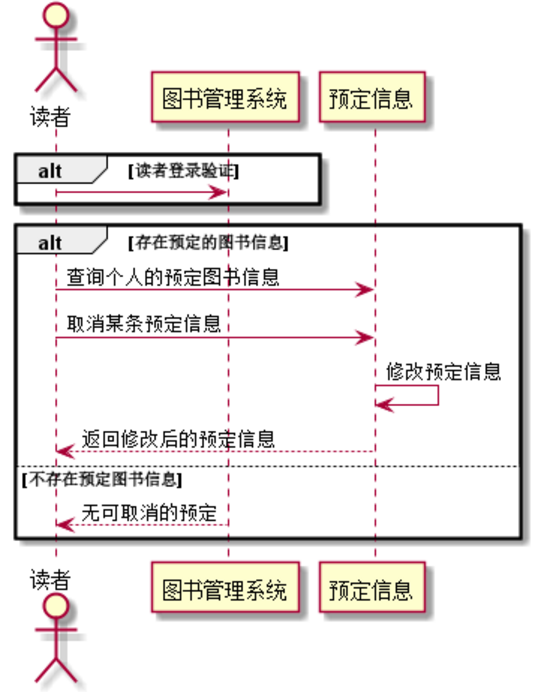
#### 5.3 取消预定用例图说明

&nbsp;&nbsp;&nbsp;&nbsp;
	读者可以登录图书管理系统来取消自己的预定图书的订单，登录后查询自己的预定信息，若查询的结果不为空，存在预定的图书信息，读者可以选择性的取消某些预定的图书信息，若查询预定的图书信息为空，则提示读者无可取消的预定信息。

---------
  

## *二、图书管理员的顺序图*

###  1、维护书目用例
#### 1.1 维护书目用例PlantUML源码:
@startuml 
actor 图书管理员 
 
alt 管理员登录验证 
图书管理员->图书管理系统 
end 
 
图书管理员->图书书目:维护图书书目 
图书书目->图书书目:查询维护后的图书书目信息 
 
图书书目-->图书管理员:显示维护后的图书书目的信息 
@enduml 
#### 1.2 维护书目用例顺序图
 
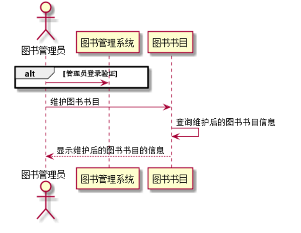
#### 1.3 维护书目用例图说明

&nbsp;&nbsp;&nbsp;&nbsp;
	图书管理员登录系统，可以对图书的种类进行增加和删除、以及对图书的分类进行修改等等一系列的操作，删除丢弃的图书信息等等

-----

###  2、库存更新用例
#### 2.1 库存更新用例PlantUML源码:
@startuml 
actor 图书管理员 
 
alt 管理员登录验证 
图书管理员->图书管理系统 
end 
 
图书管理员->图书书目:查询图书书目 
图书书目->图书:修改图书的库存量 
 
图书-->图书书目:显示更改后的图书库存 
图书书目->图书书目:查询库存更改后的图书书目信息 
图书书目-->图书管理员:显示库存更改后的图书信息 
@enduml 

#### 2.2 库存更新用例顺序图
 
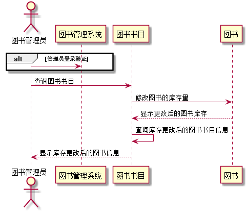
#### 2.3 库存更新用例图说明

&nbsp;&nbsp;&nbsp;&nbsp;
	图书管理员可以对图书的库存量进行修改，保证图书的库存量得到及时的更新，保证读者在借阅时不会出现图书管理系统显示的余量和实际的库存数量不一致，导致不必要的问题发生。

-----

###  3、归还图书用例
#### 3.1 归还图书用例PlantUML源码:
@startuml 
actor 图书管理员 
 
alt 管理员登录验证 
图书管理员->图书管理系统 
end 
 
图书管理员->读者:查询归还图书的读者信息 
alt 借阅图书未超期 
图书管理员->图书借阅信息:查询读者的图书借阅信息 
读者->图书借阅信息:归还图书信息 
图书借阅信息->图书借阅信息:修改借阅信息的状态 
图书借阅信息-->读者:归还成功 
图书管理系统-->图书管理员:读者图书归还成功 
 
else 图书借阅超期归还 
图书管理员->图书借阅信息:查询读者的图书借阅信息 
读者->罚款:缴纳罚款 
图书借阅信息->图书借阅信息:修改借阅信息的状态 
罚款-->读者:返回罚款的描述信息 
图书借阅信息-->读者:超期归还 
图书管理系统-->图书管理员:读者图书超期归还 
end 
@enduml 

#### 3.2 归还图书用例顺序图
 
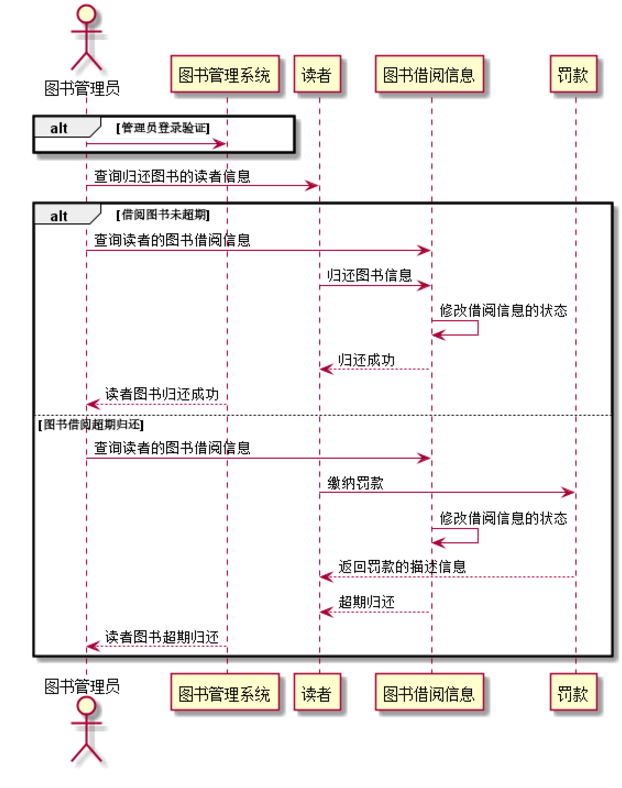
#### 3.3 归还图书用例图说明

&nbsp;&nbsp;&nbsp;&nbsp;
	读者在归还图书时，系统会判断该书的借阅时间是否超过规定的借阅时间，若是在正常的借阅时间内，则修改读者的借阅信息，修改图书的库存，完成还书操作，若是借阅超期，则需要读者缴纳一定的超期罚款，然后修改读者的借阅信息和图书的库存，完成还书的操作。

-----

###  4、借阅图书用例
#### 4.1 借阅图书用例PlantUML源码:

@startuml 
actor 图书管理员 
 
alt 管理员登录验证 
图书管理员->图书管理系统 
end 

图书管理员->读者:查询读者的信息 
alt 可借书量大于0 
读者->借阅信息:查询是否还能借书 
读者->图书:借阅 
借阅信息->借阅信息:修改借阅信息 
图书-->读者:借阅图书成功 
 
else 可借书量为0 
读者->借阅信息:查询是否还能借书 
借阅信息-->读者:可剩余借书量为0 
Par 拒接借阅 
图书管理系统->读者:可借书量为0，不能借阅图书，请归还后在借阅 
图书管理员->读者:拒绝借阅 
end 
end 
@enduml 

#### 4.2 借阅图书用例顺序图
 
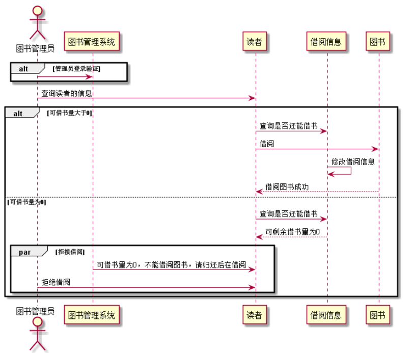
#### 4.3 借阅图书用例图说明

&nbsp;&nbsp;&nbsp;&nbsp;
	读者在借阅图书时，需要判断该读者是否还能够借阅图书，若是可借书量大于0，则允许借阅一本图书，反之则不能借阅图书。提示归还图书后，方可借阅。

-----

###  5、维护读者信息用例
#### 5.1 维护读者信息用例PlantUML源码:

@startuml 
actor 图书管理员 
 
alt 管理员登录验证 
图书管理员->图书管理系统 
end 
 
图书管理员->读者:查询所有读者的信息 
图书管理员->读者:维护读者信息 
读者->读者:修改读者信息 
读者-->图书管理员:返回维护后的读者信息 
 

@enduml 

#### 5.2 维护读者信息用例顺序图
 
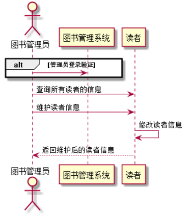
#### 5.3 维护读者信息用例图说明

&nbsp;&nbsp;&nbsp;&nbsp;
	图书管理员可以对读者的信息进行相应的修改操作，便于对读者进行一定的维护操作。

-----

###  6、增加图书用例
#### 6.1 增加图书用例PlantUML源码:

@startuml 
actor 图书管理员 
 
alt 管理员登录验证 
图书管理员->图书管理系统 
end 
 
图书管理员->图书:增加图书信息 
图书管理员->图书书目:查询增加图书后的书目信息 
图书书目-->图书管理员:显示增加图书后的书目信息 
 

@enduml 

#### 6.2 增加图书用例顺序图
 
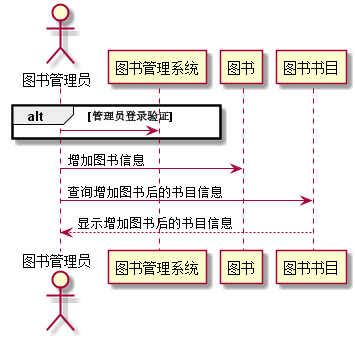
#### 6.3 增加图书用例图说明

&nbsp;&nbsp;&nbsp;&nbsp;
图书管理员可增加一些新的图书，以便能随时的更新图书的藏书。

