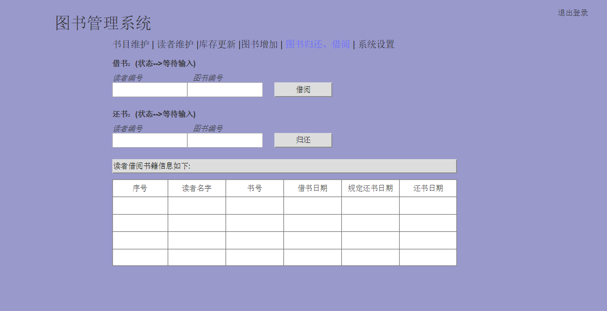
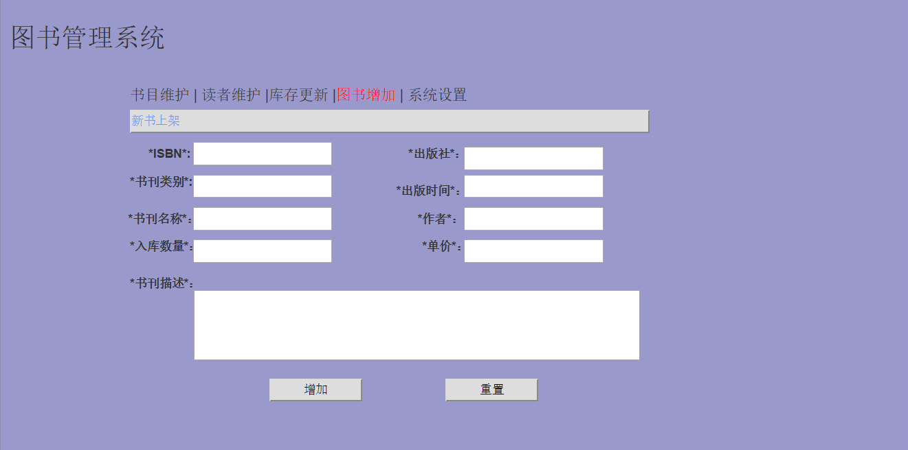
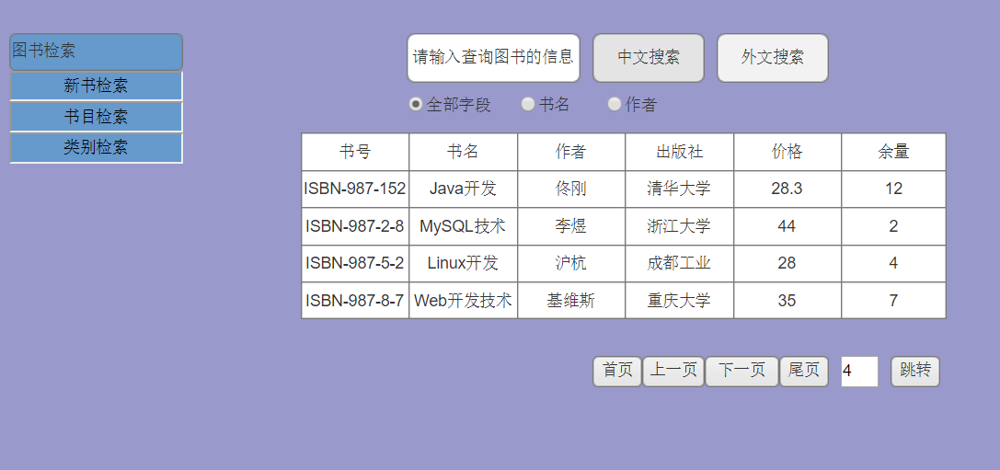

# 实验5: 图书管理系统数据库设计与界面设计

-------

## 1、数据库表的设计

### 1.1 读者信息表
 
<table cellspacing="0">
<tr>
	<td>字段</td>
	<td>类型</td>
	<td>主键、外键</td>
	<td>是否为空</td>
	<td>默认值</td>
	<td>约束</td>
	<td>说明</td>
</tr>

<tr>
	<td>id</td>
	<td>int(8)</td>
	<td>主键</td>
	<td>否</td>
	<td>1</td>
	<td></td>
	<td>读者信息表的主键id值</td>
</tr>
<tr>
	<td>accountId</td>
	<td>int(8)</td>
	<td>外键</td>
	<td>否</td>
	<td></td>
	<td></td>
	<td>账号信息表的ID值</td>
</tr>

<tr>
	<td>studentNo</td>
	<td>char(12)</td>
	<td></td>
	<td>否</td>
	<td></td>
	<td>必须为12位的纯数字值</td>
	<td>学生的学号值</td>
</tr>

<tr>
	<td>name</td>
	<td>varchar(16)</td>
	<td></td>
	<td>否</td>
	<td></td>
	<td></td>
	<td>名字</td>
</tr>
<tr>
	<td>age</td>
	<td>tinyint(2)</td>
	<td></td>
	<td>否</td>
	<td></td>
	<td></td>
	<td>年龄</td>
</tr>
<tr>
	<td>sex</td>
	<td>char(2)</td>
	<td></td>
	<td>否</td>
	<td></td>
	<td></td>
	<td>性别</td>
</tr>
<tr>
	<td>tel</td>
	<td>char(11)</td>
	<td></td>
	<td></td>
	<td></td>
	<td>必须为11位的纯数字值</td>
	<td>电话</td>
</tr>

<tr>
	<td>major</td>
	<td>varchar(32)</td>
	<td></td>
	<td>否</td>
	<td></td>
	<td></td>
	<td>专业</td>
</tr>

<tr>
	<td>acdemic</td>
	<td>varchar(32)</td>
	<td></td>
	<td>否</td>
	<td></td>
	<td></td>
	<td>学院</td>
</tr>

<tr>
	<td>email</td>
	<td>varchar(16)</td>
	<td></td>
	<td></td>
	<td></td>
	<td></td>
	<td>邮箱</td>
</tr>

<tr>
	<td>address</td>
	<td>varchar(32)</td>
	<td></td>
	<td></td>
	<td></td>
	<td></td>
	<td>居住地</td>
</tr>
<tr>
	<td>borrowedSize</td>
	<td>tinyint(2)</td>
	<td></td>
	<td></td>
	<td>0</td>
	<td></td>
	<td>已借阅图书量</td>
</tr>

<tr>
	<td>borrowableSize</td>
	<td>tinyint(2)</td>
	<td></td>
	<td></td>
	<td>0</td>
	<td></td>
	<td>可借阅图书数量</td>
</tr>

<tr>
	<td>orderSize</td>
	<td>tinyint(2)</td>
	<td></td>
	<td></td>
	<td>0</td>
	<td></td>
	<td>预定图书数量</td>
</tr>

<tr>
	<td>lastLoginTime</td>
	<td>datetime</td>
	<td></td>
	<td></td>
	<td></td>
	<td></td>
	<td>上次登录时间</td>
</tr>
</table>

--------

### 1.2 图书管理员信息表

<table cellspacing="0">
<tr>
	<td>字段</td>
	<td>类型</td>
	<td>主键、外键</td>
	<td>是否可为空</td>
	<td>默认值</td>
	<td>约束</td>
	<td>说明</td>
</tr>

<tr>
	<td>id</td>
	<td>int(6)</td>
	<td>主键</td>
	<td>否</td>
	<td>1</td>
	<td></td>
	<td>主键ID值，为自增</td>
</tr>
<tr>
	<td>accountId</td>
	<td>int(8)</td>
	<td>外键</td>
	<td>否</td>
	<td></td>
	<td></td>
	<td>账号信息表的ID值</td>
</tr>
<tr>
	<td>managerNo</td>
	<td>char(12)</td>
	<td></td>
	<td>否</td>
	<td></td>
	<td></td>
	<td>管理员的编号值</td>
</tr>
<tr>
	<td>name</td>
	<td>varchar(16)</td>
	<td></td>
	<td>否</td>
	<td></td>
	<td></td>
	<td>姓名</td>
</tr>
<tr>
	<td>age</td>
	<td>tinyint(2)</td>
	<td></td>
	<td>否</td>
	<td></td>
	<td></td>
	<td>年龄</td>
</tr>
<tr>
	<td>sex</td>
	<td>char(2)</td>
	<td></td>
	<td></td>
	<td></td>
	<td></td>
	<td>性别</td>
</tr>
<tr>
	<td>tel</td>
	<td>char(11)</td>
	<td></td>
	<td>否</td>
	<td></td>
	<td>必须为11位的纯数字</td>
	<td>电话</td>
</tr>
<tr>
	<td>email</td>
	<td>varhcar(32)</td>
	<td></td>
	<td></td>
	<td></td>
	<td></td>
	<td>邮箱</td>
</tr>

<tr>
	<td>address</td>
	<td>varchar(32)</td>
	<td></td>
	<td></td>
	<td></td>
	<td></td>
	<td>居住地</td>
</tr>

</table>

-------

### 1.3 图书信息表

<table cellspacing="0">
<tr>
	<td>字段</td>
	<td>类型</td>
	<td>主键、外键</td>
	<td>是否可为空</td>
	<td>默认值</td>
	<td>约束</td>
	<td>说明</td>
</tr>

<tr>
	<td>id</td>
	<td>int(8)</td>
	<td>主键</td>
	<td>否</td>
	<td></td>
	<td></td>
	<td>图书的ID编号值</td>
</tr>
<tr>
	<td>name</td>
	<td>varchar(64)</td>
	<td></td>
	<td>否</td>
	<td></td>
	<td></td>
	<td>书名</td>
</tr>

<tr>
	<td>author</td>
	<td>varchar(64)</td>
	<td></td>
	<td>否</td>
	<td></td>
	<td></td>
	<td>作者</td>
</tr>

<tr>
	<td>price</td>
	<td>float(7,2)</td>
	<td></td>
	<td>否</td>
	<td></td>
	<td>小数点后两位</td>
	<td>价格</td>
</tr>
<tr>
	<td>publishName</td>
	<td>varchar(32)</td>
	<td></td>
	<td>否</td>
	<td></td>
	<td></td>
	<td>出版社名字</td>
</tr>
<tr>
	<td>publishTime</td>
	<td>datetime</td>
	<td></td>
	<td>否</td>
	<td></td>
	<td></td>
	<td>出版时间</td>
</tr>
<tr>
	<td>borrowedSize</td>
	<td>int(5)</td>
	<td></td>
	<td></td>
	<td>0</td>
	<td></td>
	<td>已借阅出去的图书数量</td>
</tr>
<tr>
	<td>borrowableSize</td>
	<td>int(5)</td>
	<td></td>
	<td></td>
	<td>0</td>
	<td>大于等于0</td>
	<td>可借阅的图书数量</td>
</tr>
<tr>
	<td>sumBorrowSize</td>
	<td>int(8)</td>
	<td></td>
	<td></td>
	<td>0</td>
	<td></td>
	<td>该图书的总借阅次数</td>
</tr>
<tr>
	<td>ISBN</td>
	<td>varchar(32)</td>
	<td></td>
	<td>否</td>
	<td></td>
	<td>必须为严格的ISBN格式的值</td>
	<td>图书的ISBN号</td>
</tr>
<tr>
	<td>kindId</td>
	<td>varchar(32)</td>
	<td>外键</td>
	<td>否</td>
	<td></td>
	<td>该值必须要在图书信息分类表中存在</td>
	<td>图书的分类编号</td>
</tr>
<tr>
	<td>desciption</td>
	<td>text</td>
	<td></td>
	<td></td>
	<td></td>
	<td></td>
	<td>描述</td>
</tr>

</table>

------

### 1.4 账号信息表
<table cellspacing="0">
<tr>
	<td>字段</td>
	<td>类型</td>
	<td>主键、外键</td>
	<td>是否可为空</td>
	<td>默认值</td>
	<td>约束</td>
	<td>说明</td>
</tr>

<tr>
	<td>id</td>
	<td>int(8)</td>
	<td>主键</td>
	<td>否</td>
	<td></td>
	<td></td>
	<td>账号表的主键值</td>
</tr>
<tr>
	<td>account</td>
	<td>char(12)</td>
	<td></td>
	<td>否</td>
	<td></td>
	<td></td>
	<td>账号值</td>
</tr>
<tr>
	<td>password</td>
	<td>char(32)</td>
	<td></td>
	<td>否</td>
	<td></td>
	<td>使用MD5加密后的值</td>
	<td>密码</td>
</tr>
<tr>
	<td>role</td>
	<td>varchar(16)</td>
	<td></td>
	<td>否</td>
	<td></td>
	<td></td>
	<td>角色</td>
</tr>
<tr>
	<td>isAlive</td>
	<td>tinyint(1)</td>
	<td></td>
	<td>否</td>
	<td>1</td>
	<td></td>
	<td>是否可用</td>
</tr>

</table>

----

### 1.5 借阅信息表
<table cellspacing="0">
<tr>
	<td>字段</td>
	<td>类型</td>
	<td>主键、外键</td>
	<td>是否可为空</td>
	<td>默认值</td>
	<td>约束</td>
	<td>说明</td>
</tr>

<tr>
	<td>id</td>
	<td>int(8)</td>
	<td>主键</td>
	<td>否</td>
	<td>1</td>
	<td></td>
	<td>借阅表的ID值</td>
</tr>
<tr>
	<td>studentId</td>
	<td>char(12)</td>
	<td>外键</td>
	<td>否</td>
	<td></td>
	<td>该值必须存在于读者信息表中</td>
	<td>读者表的ID值</td>
</tr>
<tr>
	<td>bookId</td>
	<td>char(16)</td>
	<td>外键</td>
	<td>否</td>
	<td></td>
	<td>该值必须存在于图书表中</td>
	<td>图书表的ID值</td>
</tr>
<tr>
	<td>borrowTime</td>
	<td>datetime</td>
	<td></td>
	<td></td>
	<td></td>
	<td></td>
	<td>借书时间</td>
</tr>
<tr>
	<td>shouldReturnTime</td>
	<td>datetime</td>
	<td></td>
	<td></td>
	<td></td>
	<td></td>
	<td>规定还书时间</td>
</tr>
<tr>
	<td>realReturnTime</td>
	<td>datetime</td>
	<td></td>
	<td></td>
	<td></td>
	<td>必须小于当前时间值</td>
	<td>实际还书的时间</td>
</tr>
<tr>
	<td>isBeyond</td>
	<td>tinyint(1)</td>
	<td></td>
	<td></td>
	<td></td>
	<td></td>
	<td>是否超期</td>
</tr>
<tr>
	<td>managerId</td>
	<td>int(5)</td>
	<td>外键</td>
	<td>否</td>
	<td></td>
	<td>必须为管理员表中的ID值</td>
	<td>管理员的ID值</td>
</tr>
<tr>
	<td>fineId</td>
	<td>char(16)</td>
	<td>外键</td>
	<td></td>
	<td></td>
	<td>该值为空或者值必须在罚款表中存在</td>
	<td>罚款表的ID值</td>
</tr>
<tr>
	<td>orderId</td>
	<td>char(16)</td>
	<td>外键</td>
	<td></td>
	<td></td>
	<td></td>
	<td>预定编号</td>
</tr>

</table>

-----

### 1.6 罚款信息表
<table cellspacing="0">
<tr>
	<td>字段</td>
	<td>类型</td>
	<td>主键、外键</td>
	<td>是否可为空</td>
	<td>默认值</td>
	<td>约束</td>
	<td>说明</td>
</tr>

<tr>
	<td>id</td>
	<td>int(5)</td>
	<td>主键</td>
	<td>否</td>
	<td></td>
	<td></td>
	<td>罚款表的ID值</td>
</tr>
<tr>
	<td>studentId</td>
	<td>int</td>
	<td>外键</td>
	<td></td>
	<td></td>
	<td>该值必须在读者表中存在</td>
	<td>读者的ID值</td>
</tr>
<tr>
	<td>bookId</td>
	<td>int</td>
	<td>外键</td>
	<td>否</td>
	<td></td>
	<td>该值必须在图书表中存在</td>
	<td>图书的ID值</td>
</tr>
<tr>
	<td>fineDesciption</td>
	<td>text</td>
	<td></td>
	<td></td>
	<td></td>
	<td></td>
	<td>罚款信息描述</td>
</tr>
<tr>
	<td>fineSize</td>
	<td>float(7,2)</td>
	<td></td>
	<td></td>
	<td>0</td>
	<td></td>
	<td>罚款金额</td>
</tr>
<tr>
	<td>managerId</td>
	<td>int</td>
	<td>外键</td>
	<td>否</td>
	<td></td>
	<td>该值必须在管理员表中存在</td>
	<td>管理员的ID值</td>
</tr>
<tr>
	<td>fineTime</td>
	<td>datetime</td>
	<td></td>
	<td>否</td>
	<td></td>
	<td></td>
	<td>罚款时间</td>
</tr>

</table>

-------

### 1.7 预定信息表

<table cellspacing="0">
<tr>
	<td>字段</td>
	<td>类型</td>
	<td>主键、外键</td>
	<td>是否可为空</td>
	<td>默认值</td>
	<td>约束</td>
	<td>说明</td>
</tr>

<tr>
	<td>id</td>
	<td>int(8)</td>
	<td>主键</td>
	<td>否</td>
	<td>1</td>
	<td></td>
	<td>预定表的主键值</td>
</tr>
<tr>
	<td>studentId</td>
	<td>int(8)</td>
	<td>外键</td>
	<td>否</td>
	<td></td>
	<td>该值必须存在于读者表中</td>
	<td>读者的ID值</td>
</tr>
<tr>
	<td>orderTime</td>
	<td>datetime</td>
	<td></td>
	<td>否</td>
	<td></td>
	<td></td>
	<td>预定时间</td>
</tr>
<tr>
	<td>bookId</td>
	<td>int(8)</td>
	<td>外键</td>
	<td>否</td>
	<td></td>
	<td>必须存在于图书表中</td>
	<td>图书的编号值</td>
</tr>
<tr>
	<td>fetchTime</td>
	<td>datetime</td>
	<td></td>
	<td></td>
	<td></td>
	<td></td>
	<td>取书时间</td>
</tr>
<tr>
	<td>isCancel</td>
	<td>tinyint(1)</td>
	<td></td>
	<td></td>
	<td></td>
	<td></td>
	<td>是否取消了预定</td>
</tr>
<tr>
	<td>isBeyondNoFecth</td>
	<td>tinyint(1)</td>
	<td></td>
	<td></td>
	<td></td>
	<td></td>
	<td>是否超期未取</td>
</tr>
<tr>
	<td>isAvailable</td>
	<td>tinyint(1)</td>
	<td></td>
	<td></td>
	<td></td>
	<td></td>
	<td>是否可用取书</td>
</tr>

</table>

-----

### 1.8 图书分类信息表

<table cellspacing="0">
<tr>
	<td>字段</td>
	<td>类型</td>
	<td>主键、外键</td>
	<td>是否可为空</td>
	<td>默认值</td>
	<td>约束</td>
	<td>说明</td>
</tr>

<tr>
	<td>id</td>
	<td>int(8)</td>
	<td>主键</td>
	<td>否</td>
	<td>1</td>
	<td></td>
	<td>图书分类的主键值</td>
</tr>

<tr>
	<td>name</td>
	<td>varchar(32)</td>
	<td></td>
	<td>否</td>
	<td></td>
	<td></td>
	<td>分类名</td>
</tr>

<tr>
	<td>description</td>
	<td>text</td>
	<td></td>
	<td>否</td>
	<td></td>
	<td></td>
	<td>分类描述信息</td>
</tr>

</table>

--------

## 2、所有用例的API接口信息

### **对管理员来说**
---------
### 1.库存更新:stockUpdate
- 功能: 管理员更新库存
- 请求地址: http://bookmanagesystem/manager/stockUpdate
- 请求方式: POST
- 请求参数: 

<table cellspacing="0">
<tr>
	<td>参数名称</td>
	<td>必填</td>
	<td>说明</td>
</tr>
<tr>
	<td>bookId</td>
	<td>是</td>
	<td>图书的ID值</td>
</tr>
<tr>
	<td>borrowableSize</td>
	<td>是</td>
	<td>增加的图书数量值，可以为负值，则为减少多少图书库存</td>
</tr>
</table>
- 返回实例:
<pre>
{
    "info": "图书库存更新成功",
    "data": {
	    "id": "16445",
	    "name": "JavaEE高级开发技术",
	    "price": "25.3",
	    "publishName": "清华大学出版社",
	    "publishTime": "2012-02-02",
	    "borrowableSize": "21",
		"borrowedSize": "13",
	    "sumBorrowSize": 780,
		"kindId":34,
	    "ISBN":"978-7-302-41863-4",
		"description":"图书的具体描述信息"
    },
    "code": 200
}

</pre>

- 返回参数说明:
<table cellspacing="0">
<tr>
	<td>参数名称</td>
	<td>说明</td>
</tr>
<tr>
	<td>info</td>
	<td>操作的结果情况描述</td>
</tr>
<tr>
	<td>data</td>
	<td>返回更新库存后的图书信息</td>
</tr>
<tr>
	<td>code</td>
	<td>状态嘛，正常成功执行为200</td>
</tr>
</table>

---------

### 2.归还图书:returnBook
 

- 功能: 管理员处理图书归还
- 请求地址: http://bookmanagesystem/manager/returnBook
- 请求方式: POST
- 请求参数: 

<table cellspacing="0">
<tr>
	<td>参数名称</td>
	<td>必填</td>
	<td>说明</td>
</tr>
<tr>
	<td>bookId</td>
	<td>是</td>
	<td>归还图书的ID值</td>
</tr>
<tr>
	<td>studentId</td>
	<td>是</td>
	<td>还书人的ID值</td>
</tr>
<tr>
	<td>managerId</td>
	<td>是</td>
	<td>处理此次还书的管理员的ID值</td>
</tr>
</table>
- 返回实例:
<pre>
{
    "info": "还书成功",
    "data": null,
    "code": 200
}

</pre>

- 返回参数说明:
<table cellspacing="0">
<tr>
	<td>参数名称</td>
	<td>说明</td>
</tr>
<tr>
	<td>info</td>
	<td>操作的结果信息描述</td>
</tr>
<tr>
	<td>status</td>
	<td>执行持久化操作的结果</td>
</tr>
<tr>
	<td>code</td>
	<td>表示此次操作的结果正常执行</td>
</tr>
</table>

---------

### 3.借出图书:borrowBook
- 功能: 管理员处理图书借出
- 请求地址: http://bookmanagesystem/manager/borrowBook
- 请求方式: POST
- 请求参数: 

<table cellspacing="0">
<tr>
	<td>参数名称</td>
	<td>必填</td>
	<td>说明</td>
</tr>
<tr>
	<td>bookId</td>
	<td>是</td>
	<td>图书的ID值</td>
</tr>
<tr>
	<td>studentId</td>
	<td>是</td>
	<td>学生的ID值</td>
</tr>
<tr>
	<td>managerId</td>
	<td>是</td>
	<td>管理员的ID值</td>
</tr>
</table>
- 返回实例:
<pre>
{
    "info": "借书成功",
	"data":null,
	"code":200
}

</pre>

- 返回参数说明:
<table cellspacing="0">
<tr>
	<td>参数名称</td>
	<td>说明</td>
</tr>
<tr>
	<td>info</td>
	<td>对此次操作的结果描述</td>
</tr>
<tr>
	<td>data</td>
	<td>此次操作的返回数据部分为空</td>
</tr>
<tr>
	<td>status</td>
	<td>此次操作的状态标识信息</td>
</tr>
</table>

---------

### 4.维护读者信息:fixReaderInfo
- 功能: 管理员去维护读者的信息
- 请求地址: http://bookmanagesystem/manager/fixReaderInfo
- 请求方式: POST
- 请求参数: 

<table cellspacing="0">
<tr>
	<td>参数名称</td>
	<td>必填</td>
	<td>说明</td>
</tr>
<tr>
	<td>studentId</td>
	<td>是</td>
	<td>读者的编号ID值</td>
</tr>
<tr>
	<td>name</td>
	<td>否</td>
	<td>修改后的姓名值</td>
</tr>
<tr>
	<td>age</td>
	<td>否</td>
	<td>修改后的年龄值</td>
</tr>
<tr>
	<td>sex</td>
	<td>否</td>
	<td>修改后的性别值</td>
</tr>
<tr>
	<td>tel</td>
	<td>否</td>
	<td>修改后的电话值</td>
</tr>
<tr>
	<td>email</td>
	<td>否</td>
	<td>修改后的邮箱值</td>
</tr>
<tr>
	<td>password</td>
	<td>否</td>
	<td>新的密码值</td>
</tr>

</table>
- 返回实例:
<pre>
{
    "info": "读者信息维护成功",
    "data": {
   	"studentNo":"201510414406",
	"account":"648779661615",
	"name":"jcl",
	"age":21,
	"sex":"男",
	"tel":"17723561489",
	"major":"软件工程",
	"academic":"信息科学与工程",
	"email":"jcl@163.com",
	"borrowedSize":3,
	"borrowableSize:17,
	"orderSize":0,
	"lastLoginTime":"2015-02-04 14:12:14",
	"address":"四川"
    },
    "code": 200
}

</pre>

- 返回参数说明:
<table cellspacing="0">
<tr>
	<td>参数名称</td>
	<td>说明</td>
</tr>
<tr>
	<td>info</td>
	<td>操作的结果信息描述</td>
</tr>
<tr>
	<td>data</td>
	<td>修改读者成功后的读者信息</td>
</tr>
<tr>
	<td>code</td>
	<td>标志此次操作的结果状态码</td>
</tr>
</table>

---------
### 5.增加图书:addBook

- 功能: 管理员增加图书信息
- 请求地址: http://bookmanagesystem/manager/addBook
- 请求方式: POST
- 请求参数: 

<table cellspacing="0">
<tr>
	<td>参数名称</td>
	<td>必填</td>
	<td>说明</td>
</tr>
<tr>
	<td>name</td>
	<td>是</td>
	<td>图书名字</td>
</tr>
<tr>
	<td>price</td>
	<td>是</td>
	<td>图书价格</td>
</tr>
<tr>
	<td>publishName</td>
	<td>是</td>
	<td>出版社</td>
</tr>
<tr>
	<td>publishTime</td>
	<td>是</td>
	<td>出版时间</td>
</tr>
<tr>
	<td>borrowableSize</td>
	<td>是</td>
	<td>可借阅图书量</td>
</tr>
<tr>
	<td>kindId</td>
	<td>否</td>
	<td>分类编号</td>
</tr>
<tr>
	<td>ISBN</td>
	<td>是</td>
	<td>ISBN的值</td>
</tr>
<tr>
	<td>description</td>
	<td>否</td>
	<td>图书描述</td>
</tr>

</table>
- 返回实例:
<pre>
{
    "info": "增加图书成功",
    "data": null,
    "code": 200
}

</pre>

- 返回参数说明:
<table cellspacing="0">
<tr>
	<td>参数名称</td>
	<td>说明</td>
</tr>
<tr>
	<td>info</td>
	<td>增加图书操作的结果信息描述</td>
</tr>
<tr>
	<td>data</td>
	<td>此次操作的数据部分的返回值</td>
</tr>
<tr>
	<td>code</td>
	<td>增加图书操作的状态码</td>
</tr>
</table>

---------

### **对读者来说**

### 1.查询书目:queryBook

- 功能: 读者查询图书书目信息
- 请求地址: http://bookmanagesystem/reader/queryBook
- 请求方式: POST
- 请求参数: 

<table cellspacing="0">
<tr>
	<td>参数名称</td>
	<td>必填</td>
	<td>说明</td>
</tr>
<tr>
	<td>name</td>
	<td>否</td>
	<td>图书名字</td>
</tr>
<tr>
	<td>author</td>
	<td>否</td>
	<td>图书作者</td>
</tr>
<tr>
	<td>publishName</td>
	<td>否</td>
	<td>出版社名字</td>
</tr>
</table>
- 返回实例:
<pre>
{
    "info": "查询书目成功",
    "data": {
    [
	{
	"id": "16445",
	"name": "JavaEE高级开发技术",
	"price": "25.3",
	"publishName": "清华大学出版社",
	"publishTime": "2012-02-02",
	"borrowableSize": "21",
	"borrowedSize": "13",
	"sumBorrowSize": 780,
	"kindId":34,
	"ISBN":"978-7-302-41863-4",
	"description":"图书的具体描述信息"			
	},
	{
	"id": "9979422",
	"name": "MySQL从入门到精通",
	"price": "55.3",
	"publishName": "浙江大学出版社",
	"publishTime": "2018-12-04",
	"borrowableSize": "14",
	"borrowedSize": "20",
	"sumBorrowSize": 1245,
	"kindId":48,
	"ISBN":"978-7-32-4163-5",
	"description":"适合于初学者的数据库入门级图书"	
	},
	......
	]
    },
    "code": 200
}

</pre>

- 返回参数说明:
<table cellspacing="0">
<tr>
	<td>参数名称</td>
	<td>说明</td>
</tr>
<tr>
	<td>info</td>
	<td>此次操作的结果信息描述</td>
</tr>
<tr>
	<td>data</td>
	<td>返回查询到所有图书的详细信息</td>
</tr>
<tr>
	<td>code</td>
	<td>此次操作的状态码</td>
</tr>
</table>

---------
### 2.预定图书:orderBook
- 功能: 读者预定图书
- 请求地址: http://bookmanagesystem/reader/orderBook
- 请求方式: POST
- 请求参数: 

<table cellspacing="0">
<tr>
	<td>参数名称</td>
	<td>必填</td>
	<td>说明</td>
</tr>
<tr>
	<td>studentId</td>
	<td>是</td>
	<td>预订者的ID值</td>
</tr>
<tr>
	<td>bookId</td>
	<td>是</td>
	<td>图书信息的ID值</td>
</tr>
</table>
- 返回实例:
<pre>
{
    "info": "图书预定成功",
    "data": null,
    "code": 200
}

</pre>

- 返回参数说明:
<table cellspacing="0">
<tr>
	<td>参数名称</td>
	<td>说明</td>
</tr>
<tr>
	<td>info</td>
	<td>预定图书结果的信息描述</td>
</tr>
<tr>
	<td>data</td>
	<td>预定图书操作的数据返回</td>
</tr>
<tr>
	<td>code</td>
	<td>预定图书操作的状态码</td>
</tr>
</table>

---------
### 3.取消预订:cancelOrder
- 功能: 读者取消图书的预定
- 请求地址: http://bookmanagesystem/reader/cancelOrder
- 请求方式: POST
- 请求参数: 

<table cellspacing="0">
<tr>
	<td>参数名称</td>
	<td>必填</td>
	<td>说明</td>
</tr>
<tr>
	<td>studentId</td>
	<td>是</td>
	<td>读者的ID值</td>
</tr>
<tr>
	<td>bookId</td>
	<td>是</td>
	<td>图书的ID值</td>
</tr>
</table>
- 返回实例:
<pre>
{
    "info": "取消图书预定信息成功。",
    "data": null,
    "code": 200
}

</pre>

- 返回参数说明:
<table cellspacing="0">
<tr>
	<td>参数名称</td>
	<td>说明</td>
</tr>
<tr>
	<td>info</td>
	<td>取消图书预定操作的结果信息描述</td>
</tr>
<tr>
	<td>data</td>
	<td>取消图书预定操作的数据部分的值</td>
</tr>
<tr>
	<td>code</td>
	<td>此次操作的状态码</td>
</tr>
</table>

---------
### 4.查询个人借阅情况:queryBorrowInfo
- 功能: 管理员查询个人借阅情况
- 请求地址: http://bookmanagesystem/reader/queryBorrowInfo
- 请求方式: POST
- 请求参数: 

<table cellspacing="0">
<tr>
	<td>参数名称</td>
	<td>必填</td>
	<td>说明</td>
</tr>
<tr>
	<td>studentId</td>
	<td>是</td>
	<td>读者的ID值</td>
</tr>
</table>
- 返回实例:
<pre>
{
    "info": "个人信息如下",
    "data": {
	"borrowedSize":3,
	"borrowableSize":17
    },
    "code": 200
}

</pre>

- 返回参数说明:
<table cellspacing="0">
<tr>
	<td>参数名称</td>
	<td>说明</td>
</tr>
<tr>
	<td>info</td>
	<td>查询借阅操作的结果描述</td>
</tr>
<tr>
	<td>data</td>
	<td>返回对应读者的借阅信息</td>
</tr>
<tr>
	<td>code</td>
	<td>查询借阅信息的状态码</td>
</tr>
</table>

---------
### 5.查询个人信息:queryPersonalInfo
- 功能: 读者查询个人信息
- 请求地址: http://bookmanagesystem/reader/queryPersonalInfo
- 请求方式: POST
- 请求参数: 

<table cellspacing="0">
<tr>
	<td>参数名称</td>
	<td>必填</td>
	<td>说明</td>
</tr>
<tr>
	<td>studentId</td>
	<td>是</td>
	<td>读者的ID值</td>
</tr>
</table>
- 返回实例:
<pre>
{
    "info": "查询个人信息的结果如下.",
    "data": {
	"studentNo":"201510414406",
	"account":"648779661615",
	"name":"jcl",
	"age":21,
	"sex":"男",
	"tel":"17723561489",
	"major":"软件工程",
	"academic":"信息科学与工程",
	"email":"jcl@163.com",
	"borrowedSize":3,
	"borrowableSize:17,
	"orderSize":0,
	"lastLoginTime":"2015-02-04 14:12:14",
	"address":"四川"
    },
    "code": 200
}

</pre>

- 返回参数说明:
<table cellspacing="0">
<tr>
	<td>参数名称</td>
	<td>说明</td>
</tr>
<tr>
	<td>info</td>
	<td>查询个人信息操作的结果描述信息</td>
</tr>
<tr>
	<td>data</td>
	<td>对应的具体的个人信息情况</td>
</tr>
<tr>
	<td>code</td>
	<td>查询操作的状态码</td>
</tr>
</table>

