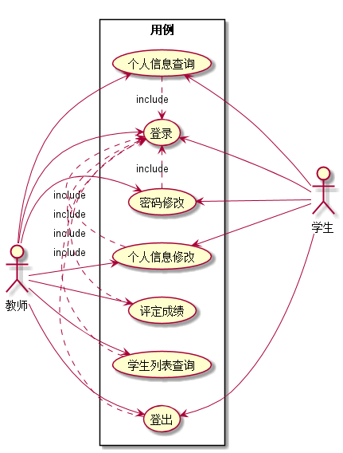
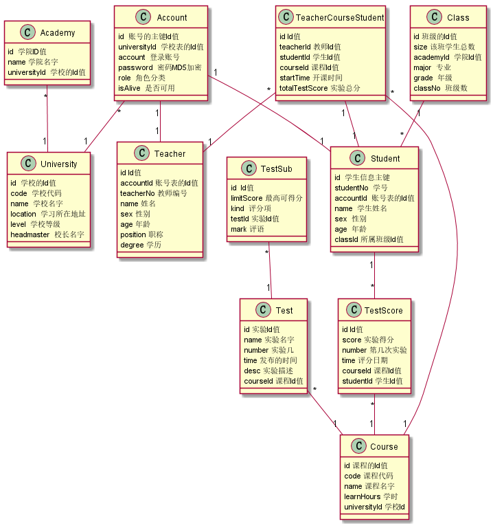

# 基于GitHub的实验管理平台的分析与设计

-------

## 1.概述
该系统的目的是为了提供在线管理实验成绩的Web应用系统，学生和老师的实验内容统一
发布在GitHub页面上。   
 
老师的主要功能:    
1. 登录该系统进行个人信息查询和修改，以及密码修改  
2. 查询教授课程的所有学生列表信息  
3. 对学生的实验进行评定分数  
4. 查询学生的实验成绩  

学生的主要功能:  
1. 登录该系统进行个人信息查询和个人信息修改以及密码修改  
2. 查询所学课程的实验成绩。

说明:一个课程有多个实验，每个实验的评分项有多个，每个评分项有分值的限制，所获得的分数只能小于等于该值，最小值为0的正整数，每个实验的总分值为100分。系统自动的计算学生的每个实验得分以及总的实验分。

## 2.系统总体结构

### 界面设计参见:<a href="https://FateBerserker.github.io/is_analysis/test6/UI/index.html">https://FateBerserker.github.io/is_analysis/test6/UI/index.html
</a>

## 3.用例图设计 <a href="">源码</a>

## 4.类图设计 <a href="">源码</a>

 

## 5.数据库设计

<a href="./数据库表设计.md">参见数据库设计</a>

## 6.用例及界面详细设计
### 1. <a href="#">"登录"用例</a>,<a href="#">界面</a>
### 2. <a href="#">"登出"用例</a>,<a href="#">界面</a>
### 3. <a href="#">"个人信息查询"用例</a>,<a href="#">界面</a>
### 4. <a href="#">"个人信息修改"用例</a>,<a href="#">界面</a>
### 5. <a href="#">"密码修改"用例</a>,<a href="#">界面</a>
### 6. <a href="#">"评定成绩"用例</a>,<a href="#">界面</a>
### 7. <a href="#">"学生列表查询"用例</a>,<a href="#">界面</a>
### 8. <a href="#">"成绩查询"用例</a>,<a href="#">界面</a>

<a href="./数据库表设计.md#testSub">TestSub</a>