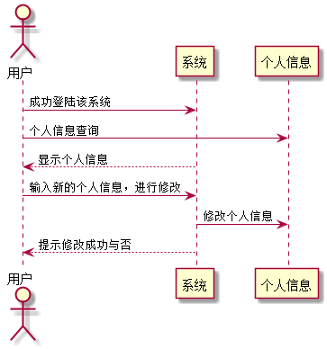

# "个人信息修改"用例 <a href="https://github.com/FateBerserker/is_analysis/tree/master/test6">返回</a>
## 1.用例规约
<table cellspacing="0" style="width:900px;">
<tr>
	<td>用例名称</td>
	<td>个人信息修改</td>	
</tr>
<tr>
	<td>功能</td>
	<td>修改个人的一些相关信息</td>	
</tr>
<tr>
	<td>参与者</td>
	<td>学生、教师</td>	
</tr>
<tr>
	<td>前置条件</td>
	<td>登陆成功该系统</td>	
</tr>
<tr>
	<td>后置条件</td>
	<td></td>	
</tr>
<tr>
	<td>主流事件</td>
	<td>
	用户输入正确需要修改的信息后，点击提交后系统进行相应的数据修改，然后返回给用户修改后的信息。
	</td>	
</tr>
<tr>
	<td>备选流事件</td>
	<td>
		1a.输入的修改信息不合法   
		 &nbsp;1.提示输入有效的数据      
		 &nbsp;2.重新输入后需再次提交表单  
		2b.数据修改异常，服务器内部错误   
		 &nbsp;1.刷新页面后，重新填写修改信息      
		 &nbsp;2.重新输入后需再次提交表单  

	</td>	
</tr>
	
</table>		

## 2. 业务流程(顺序图)  <a href="../src/updateUserInfo.puml">源码</a>

## 3.界面设计
#### &nbsp;&nbsp;&nbsp;&nbsp;界面参照:<a href="https://FateBaserker.github.io/is_analysis/test6/UI/teacher.html">https://FateBaserker.github.io/is_analysis/test6/UI/teacher.html</a>
#### &nbsp;&nbsp;&nbsp;&nbsp;API接口调用
##### &nbsp;&nbsp;&nbsp;&nbsp;&nbsp;&nbsp;&nbsp;&nbsp;&nbsp;&nbsp;接口: <a href="../接口/updateUserInfo.md">updateUserInfo</a>

## 4.算法描述
无

## 5.参照表
### <a href="../数据库表设计#account.md#account">Account</a>
### <a href="../数据库表设计#student.md#student">Student</a>
### <a href="../数据库表设计#teacher#teacher">Teacher</a>

