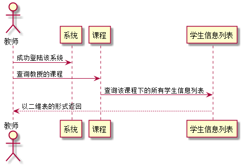

# "学生信息列表查询"用例 <a href="https://github.com/FateBerserker/is_analysis/tree/master/test6">返回</a>
## 1.用例规约
<table cellspacing="0" style="width:900px;">
<tr>
	<td>用例名称</td>
	<td>学生信息列表查询</td>	
</tr>
<tr>
	<td>功能</td>
	<td>查询教授某一课程的学生信息列表</td>	
</tr>
<tr>
	<td>参与者</td>
	<td>教师</td>	
</tr>
<tr>
	<td>前置条件</td>
	<td>登陆成功进入该系统，且角色为教师</td>	
</tr>
<tr>
	<td>后置条件</td>
	<td></td>	
</tr>
<tr>
	<td>主流事件</td>
	<td>
	用户输入对应的课程值以及传入个人的编号值，后台系统根据传入的教师编号和课程的编号值查询出对应下的学生信息列表，返回给教师
	</td>	
</tr>
<tr>
	<td>备选流事件</td>
	<td>
	1a.输入的课程不存在   
	 &nbsp;1.提示未教授该课程     
	 &nbsp;2.重新输入后需再次提交表单 
	</td>	
</tr>
	
</table>		

## 2. 业务流程(顺序图)  <a href="../src/queryStudentList.puml">源码</a>

## 3.界面设计
#### &nbsp;&nbsp;&nbsp;&nbsp;界面参照:[https://FateBaserker.github.io/is_analysis/test6/UI/teacher.html](https://FateBaserker.github.io/is_analysis/test6/UI/teacher.html)
#### &nbsp;&nbsp;&nbsp;&nbsp;API接口调用
##### &nbsp;&nbsp;&nbsp;&nbsp;&nbsp;&nbsp;&nbsp;&nbsp;&nbsp;&nbsp;接口: <a href="../接口/queryStudentList.md">queryStudentList</a>

## 4.算法描述
无

## 5.参照表
### <a href="../数据库表设计.md#student">Student</a>

