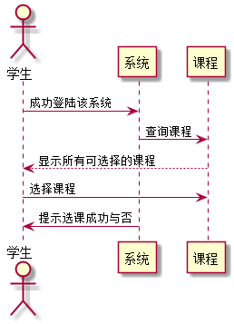

# "学生选课"用例 <a href="https://github.com/FateBerserker/is_analysis/tree/master/test6">返回</a>
## 1.用例规约
<table cellspacing="0" style="width:900px;">
<tr>
	<td>用例名称</td>
	<td>学生选课</td>	
</tr>
<tr>
	<td>功能</td>
	<td>学生进行相应课程的选则</td>	
</tr>
<tr>
	<td>参与者</td>
	<td>学生</td>	
</tr>
<tr>
	<td>前置条件</td>
	<td>超过登陆该系统，且角色为学生</td>	
</tr>
<tr>
	<td>后置条件</td>
	<td></td>	
</tr>
<tr>
	<td>主流事件</td>
	<td>
	学生选择相应的课程后,将课程值和自己的学号一起传递给后台系统，系统拿到值后进行相应的插入更新操作后，提示学生课程选择成功。
	</td>	
</tr>
<tr>
	<td>备选流事件</td>
	<td>
	1a.请勿重复选择该课程   
	 &nbsp;1.选择未选的课程      
	 &nbsp;2.重新输入后需再次提交表单  

	2a.课程暂未开课 
	 &nbsp;1.重新选择开课的课程      
	 &nbsp;2.重新输入后需再次提交表单
	</td>	
</tr>
	
</table>		

## 2. 业务流程(顺序图)  <a href="../src/studentSelectCourse.puml">源码</a>

## 3.界面设计
#### &nbsp;&nbsp;&nbsp;&nbsp;界面参照:<a href="https://FateBaserker.github.io/is_analysis/test6/ui/index.html">https://FateBaserker.github.io/is_analysis/test6/ui/index.html</a>
#### &nbsp;&nbsp;&nbsp;&nbsp;API接口调用
##### &nbsp;&nbsp;&nbsp;&nbsp;&nbsp;&nbsp;&nbsp;&nbsp;&nbsp;&nbsp;接口: <a href="../接口/studentSelectCourse.md">studentSelectCourse</a>

## 4.算法描述
无

## 5.参照表
### <a href="../数据库表设计.md#student">Student</a>
### <a href="../数据库表设计.md#course">Course</a>

