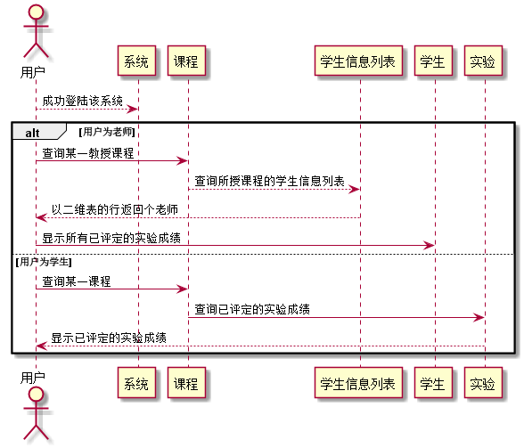

# "成绩查询"用例 <a href="https://github.com/FateBerserker/is_analysis/tree/master/test6">返回</a>
## 1.用例规约
<table cellspacing="0" style="width:900px;">
<tr>
	<td>用例名称</td>
	<td>成绩查询</td>	
</tr>
<tr>
	<td>功能</td>
	<td>查询学生的实验成绩</td>	
</tr>
<tr>
	<td>参与者</td>
	<td>学生、教师</td>	
</tr>
<tr>
	<td>前置条件</td>
	<td>成功进入该系统</td>	
</tr>
<tr>
	<td>后置条件</td>
	<td>查询成功显示实验成绩</td>	
</tr>
<tr>
	<td>主流事件</td>
	<td>
		传入正确的学生Id值，系统查询数据库得到实验成绩返回给用户
	</td>	
</tr>
<tr>
	<td>备选流事件</td>
	<td>
		传入的学生的Id值异常，查询数据库失败，提示查询异常， 
		或者请求超时，提示请检查网络情况后，稍后重试
	</td>	
</tr>
	
</table>		

## 2. 业务流程(顺序图)  <a href="../src/queryScore.puml">源码</a>

## 3.界面设计
<ul>
	<li>
		<a href="https://FateBaserker.github.io/is_analysis/test6/UI/student.html">https://FateBaserker.github.io/is_analysis/test6/UI/student.html</a>
	</li>
</ul>
#### &nbsp;&nbsp;&nbsp;&nbsp;界面参照:<a href="../UI/student.html">https://FateBaserker.github.io/is_analysis/test6/UI/student.html</a>
#### &nbsp;&nbsp;&nbsp;&nbsp;API接口调用
##### &nbsp;&nbsp;&nbsp;&nbsp;&nbsp;&nbsp;&nbsp;&nbsp;&nbsp;&nbsp;接口1: <a href="../接口/queryScore.md">queryScore</a>

## 4.算法描述
无

## 5.参照表
#### <a href="../数据库表设计.md#test">Test</a>
#### <a href="../数据库表设计.md#testSub">TestSub</a>
#### <a href="../数据库表设计.md#testScore">TestScore</a>
#### <a href="../数据库表设计.md#testSubTestScore">TestSub_TestScore</a>

